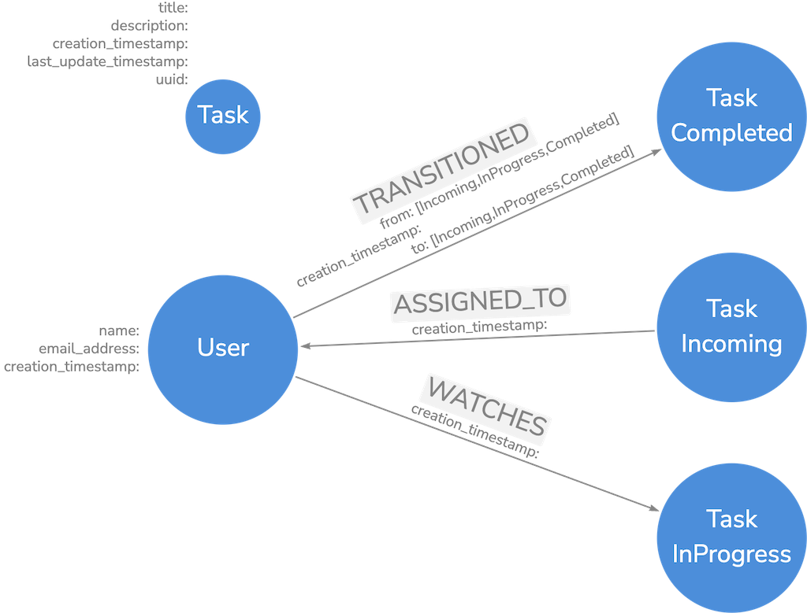

# Kafka Connector Workshop

In this workshop, we will build a very simple team-based task management application with the following requirements;

- Supports multiple users, allowing creation of new users and a simple login flow,
- New tasks can be created,
- Tasks can be assigned to a user,
- Each task can be in one of three states: Incoming, In Progress or Complete,
- When a task is assigned, the assignee will receive an email informing them of the assignment,
- When a task is created or its state is changed, the team will be informed through an email to a distribution list.

We will use an [Aura Virtual Dedicated Cloud](https://neo4j.com/product/auradb/) as a database and also make use
of [Confluent Cloud](https://www.confluent.io/confluent-cloud/) with Custom Connectors to build email capabilities to
the example application.

## Step 1: Understanding the Application

A front-end application with no connections to the database can be found in the `app` folder.
This application has been implemented using TypeScript and React wired to fake data.

In order to run the application, first make sure you have
an [LTS version of Node.js](https://nodejs.org/en/download/package-manager) installed.

First, change working directory to `app` folder:

```shell
cd app
```

Install required dependencies:

```shell
npm install
```

Start the application:

```shell
npm start
```

which will start your default browser.

You can log in using the email address `neo4j.connectors+workshop@gmail.com` and interact with fake data.
Feel free to browse the source code and familiarize yourself with the components.

## Step 2: Graph Model

What would be a good graph model for this application?

Although we could come up with a dozen of different models, what we have decided to follow can be seen in the below
image.



In a few sentences;

- We will have `User` nodes, which will only have `name`, `email_address` and `creation_timestamp` properties. Node key
  will be created on `email_address` property.
- We will have `Task` nodes, which will only have `uuid`, `title`, `description`, `creation_timestamp` and
  `last_update_timestamp` properties. Node key will be created on `uuid` property.
- Task status will be stored as an additional label on `Task` nodes.
- Every new task will have both `Task` and `Incoming` labels, and `Incoming` label will be replaced with `InProgress`
  and `Completed` based on the transitioned state.
- Assignment of tasks will be stored as `ASSIGNED_TO` typed relationships from `Task` to `User`.
- State transitions will be stored as `TRANSITIONED` typed relationships originating from `User` to `Task`. Old and new
  states will be reflected in `from` and `to` properties.
- Relationships will not be updatable, so we decided to only keep `creation_timestamp` property in relationships.
- We modeled a `WATCHES` relationship as well, which has no corresponding implementation in the exercise. Feel free to
  use it as an improvement on your own.

## Step 3: Provision your database

We need a database :smiley:.

Since we will be using [Change Data Capture](https://neo4j.com/docs/cdc) feature, we either need an existing Aura
Virtual Dedicated Cloud instance or spawn up our database locally using docker.

### Get a database

#### Option 1: Aura Virtual Dedicated Cloud

If you have access to an existing Aura VDC instance for development purposes, please head over
to [Aura Console](https://console.neo4j.io) and [enable CDC](https://neo4j.com/docs/cdc/current/get-started/aura/) on
your instance.

#### Option 2: Docker Compose

Otherwise, ensure that you have a recent version of `Docker Desktop` and `Docker Compose` installed on your computer and
launch all the services we will require throughout this workshop.

First, change directory to `docker` folder:

```shell
cd docker
```

Launch all the services, including latest version Neo4j and Confluent Platform components.

```shell
docker compose up -d
```

Wait until all components are up and running, and are reported healthy.

```shell
docker compose ps
```

You can now access your neo4j browser at `http://localhost:7474` with username `neo4j` and password `password`.
You can change these defaults in the `docker/docker-compose.yml` file.

[Enable CDC](https://neo4j.com/docs/cdc/current/get-started/self-managed/) on your database by issuing the following
statement in Neo4j Browser.

```cypher

ALTER DATABASE neo4j SET OPTION txLogEnrichment 'FULL' WAIT;
```

### Create schema and seed data

We have prepared some Liquibase change sets that initialize the required constraints for our graph model, and optionally
introduce some seed data.

#### Setup

For this, install [Liquibase](https://www.liquibase.com/download).

> `brew install liquibase` works like a charm on Mac OS.

Download [the latest Neo4j plugin release](https://github.com/liquibase/liquibase-neo4j/releases/download/v4.29.2/liquibase-neo4j-4.29.2-full.jar)
and copy it to Liquibase `lib/` folder.

> With Homebrew, this will be a path like `$(brew --prefix)/Cellar/liquibase/4.29.2/libexec/lib`.

#### Run

Now, you can run the following script:

```
./graph/run.sh <URI> <PASSWORD>
```

If you want seed data:

```
./graph/run.sh <URI> <PASSWORD> 1
```

> If you do not pass `1`, any pre-existing seed data will be removed!

For instance:

```
./graph/run.sh 'bolt://localhost' 'password' 1
```

#### Database Reset

Run:

```
liquibase rollback --tag=v0 --changelog-file ./graph/main.xml --url jdbc:neo4j:<URI> --username neo4j --password <PASSWORD>
```

## Step 4: Wire application to the database

It's fun time :tada:.

We already wired login, user list and create user flows to the database as an example. Please feel free to
play with it yourself, and take a stab on completing the task flows by yourself.

First, make sure you have installed new dependencies:

```shell
cd app
npm install
```

Then, configure Neo4j connection parameters inside an `.env.local` file:

```shell
cat > .env.local <<EOF
REACT_APP_NEO4J_URI=<URI>
REACT_APP_NEO4J_USERNAME=<USERNAME>
REACT_APP_NEO4J_PASSWORD=<PASSWORD>
EOF
```

Finally, you can start the application and see the user flows hitting the database.

```shell
npm start
```

As a starting point, we removed fake data from `UserService` and updated all functions to query the database. We used
the following best practices while doing so:

1. We have introduced a singleton `Neo4jDriver` object that holds a reference to an application wide driver object.
2. Used `@neo4j/cypher-builder` to build our Cypher statements, which allows us to build more secure applications by
   avoiding string concatenation. Refer
   to [Cypher Builder docs](https://neo4j.github.io/cypher-builder/cypher-builder/current/) for more information.
3. Used `Driver` object's `executeQuery` function to run actual queries against the database.

## Step 5: Completed application

Check out [step-5](https://github.com/neo4j/kafka-connector-workshop/tree/step-5#step-5-completed-application) and
reload this README for further instructions. 
